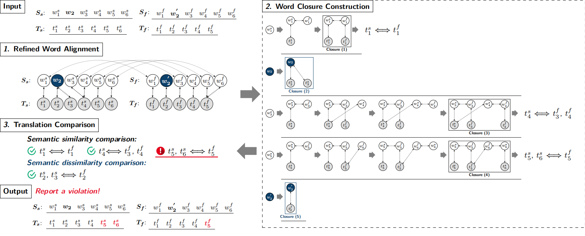

# Artifact for the Paper "Word Closure-Based Metamorphic Testing for Machine Translation"

This is the artifact for the paper "*Word Closure-Based Metamorphic Testing for Machine Translation*". This artifact supplies the replication package and the supplementary material of the paper.

## This artifact contains:
* [Introduction](#introduction)
* [Supplementary Materials](#supplementary-materials)
* [Setup](#setup)
* [Dataset](#dataset)
* [Scripts](#scripts)
* [Usage Instruction](#usage-instruction)


## Introduction

**Word Closure** is an output comparison unit for Metamorphic Testing (**MT**) of Machine Translation Systems (**MTSs**). In MT for MTS, the input comprises a pair of source and follow-up input sentences $S_s$ and $S_f$ generated through the input transformation of MRs, as well as their translations $T_s$ and $T_f$ (i.e., source and follow-up outputs) returned by MTS. We propose word closure to detect whether MTS violates the MR on the test case pair. The usage of word closure involves two modules for constructing word closures from the test case pair and one module for detecting the violation by evaluating the semantics of the translation counterparts linked by word closures. Please refer to the paper for more details.



## Supplementary Materials

- In [**`/supplements/Illustrations.md`**](supplements/Illustrations.md), we further illustrate in detail the five motivation examples presented in the paper.

## Setup
**In order to replicate the experiments, please perform the following steps to prepare necessary dependencies:**

- **Prepare a python environment:**
  - Execute the following commands:
    ```python
    conda create -n wordclosure python=3.8
    conda activate wordclosure
    pip install -r requirements.txt
    ```
  - Specifically, the following libraries in [**`requirements.txt`**](requirements.txt) will be installed:
    ```python
    apex==0.9.10dev
    boto3==1.34.15
    botocore==1.34.15
    filelock==3.13.1
    gensim==4.3.2
    jieba==0.42.1
    nltk==3.8.1
    numpy==1.24.0
    pycorenlp==0.3.0
    requests==2.25.1
    scikit_learn==1.3.2
    tokenizers==0.15.0
    torch==2.1.2
    tqdm==4.61.2
    transformers==4.36.2
    ```

- **Set up the Stanford Corenlp server:**
  - Download **`stanford-corenlp-4.5.1.zip`** from https://stanfordnlp.github.io/CoreNLP/history.html and unzip it into **`/stanford-corenlp-4.5.1`** folder.
  - Download **`stanford-corenlp-4.5.1-models-chinese.jar`** from https://stanfordnlp.github.io/CoreNLP/history.html and move it into **`/stanford-corenlp-4.5.1`** folder.
  - Execute the following commands to start the Corenlp parsing server for English language and Chinese language respectively.
    ```bash
    cd stanford-corenlp-4.5.1
    java -Xmx5g -cp "*" edu.stanford.nlp.pipeline.StanfordCoreNLPServer -preload tokenize,ssplit,pos,lemma,ner,parse,depparse -status_port 9000 -port 9000 -timeout 15000
    java -Xmx5g -cp "*" edu.stanford.nlp.pipeline.StanfordCoreNLPServer -serverProperties StanfordCoreNLP-chinese.properties -port 9001 -timeout 15000
    ```
- **Prepare word alignment tool [AWESOME](https://github.com/neulab/awesome-align):**
  - Download **`model_without_co.zip`** from https://drive.google.com/file/d/1IcQx6t5qtv4bdcGjjVCwXnRkpr67eisJ/view?usp=sharing and unzip it into the **`/scripts/model_without_co`** folder
  - Download all the files from https://github.com/neulab/awesome-align/tree/master/awesome_align and store it into the **`/scripts/awesome_align`** folder.
- **Prepare word2vector models**
  - Download **`GoogleNews-vectors-negative300.bin.gz`** from https://code.google.com/archive/p/word2vec/ and unzip it into the **`/scripts/word2vec`** folder.
  - Download **`merge_sgns_bigram_char300.txt.bz2`** from https://github.com/Embedding/Chinese-Word-Vectors and store it into the **`/scripts/word2vec`** folder.

## Dataset

**All the datasets needed for the experiment are stored in the [`/data`](data) folder.**

Structure of [**`/data`**](data) folder:
```
data
┝━━ Limitation-statistics (False Positives and False Negatives for five existing MT for MTS works)
│   ┝━━ CAT-google-FN.csv
│   ┝━━ CAT-google-FP.csv
│   ┝━━ CAT-bing-FN.csv
│   ┕━━ ...
┝━━ Motivation-examples (Five motivation examples in the paper)
│   ┝━━ CAT-en2zh-motivation.csv
│   ┝━━ CIT-en2zh-motivation.csv
│   ┕━━ ...
┝━━ RQ1 (Metamorphic test case pairs for three MTSs generated by five Metamorphic Relations)
│   ┝━━ CAT-en2zh-google.csv
│   ┝━━ CAT-en2zh-bing.csv
│   ┝━━ CAT-en2zh-youdao.csv
│   ┝━━ CIT-en2zh-google.csv
│   ┕━━ ...
┝━━ RQ2&4 (Metamorphic test case pairs for five Metamorphic Relations)
│   ┝━━ CAT-en2zh-merge.csv
│   ┝━━ CAT-zh2en-merge.csv
│   ┝━━ CIT-en2zh-merge.csv
│   ┕━━ ...
┕━━ RQ3 (Fine-grained violation locating results)
    ┝━━ CAT-en2zh-google-LABEL.txt
    ┝━━ CAT-zh2en-google-LABEL.txt
    ┝━━ CIT-en2zh-google-LABEL.txt
    ┕━━ ...
```
## Scripts

**We provide scripts for reproducing our experiment results in the [`/scripts`](scripts) folder.** 

Structure of [**`/scripts`**](scripts) folder:
```
scripts
┝━━ awesome_align/
┝━━ model_without_co/
┝━━ utils/
┝━━ word2vec/
┝━━ Limitation-statistics.py
┝━━ Motivation.py
┝━━ RQ1-en2zh.py
┝━━ RQ1-zh2en.py
┝━━ RQ2-en2zh.py
┝━━ RQ2-zh2en.py
┝━━ RQ3.py
┝━━ RQ4-en2zh.py
┝━━ RQ4-zh2en.py
┝━━ LLM-en2zh.py
┝━━ LLM-zh2en.py
┝━━ en.py
┕━━ zh.py
```

## Usage Instruction
**Please follow the steps below to reproduce all the experimental results in our paper.**

### Limitation of existing works:
- To count the number of FPs/FNs due to the limitations in existing methods, please run:
  ```bash
  cd scripts
  python Limitation-statistics.py
  ```
  The statistic results will be printed and recorded into the **`result.txt`** file in the **`/scripts/Limitation`** folder.

### Motivation Examples:
- To run our word closure-based comparison method on the five motivation examples in the paper, please execute:
  ```bash
  python Motivation.py
  ```
  The detailed execution results of our word closure-based comparison method will be printed.

### RQ1: The overall effectiveness of our approach in identifying violations.
- To replicate the experiment results of RQ1, please run:
  ```bash
  python RQ1-en2zh.py
  python RQ1-zh2en.py
  ```
  The evaluation results will be printed and recorded into the **`result_en2zh.txt`** and **`result_zh2en.txt`** files in the `/scripts/RQ1` folder.

### RQ2: Compare with the naive comparison strategies based on native grammar units.
- To replicate the experiment results of RQ2, please run:
  ```bash
  python RQ2-en2zh.py
  python RQ2-zh2en.py
  ```
  The comaprison results will be printed and recorded into the **`result_en2zh.txt`** and **`result_zh2en.txt`** files in the **`/scripts/RQ2`** folder.

### RQ3: The effectiveness of our approach in locating fine-grained violations.
- To replicate the experiment results of RQ3, please run:
  ```bash
  python RQ3.py
  ```
  The evaluation results will be printed and recorded into the **`result_en2zh.txt`** and **`result_zh2en.txt`** files in the **`/scripts/RQ3`** folder.

### RQ4: Configuration selection.
- To replicate the experiment results of RQ4, please run:
  ```bash
  python RQ4-en2zh.py
  python RQ4-zh2en.py
  ```
  The evaluation results of our method with its highest F1 score under different configurations will be printed and recorded into the **`result_en2zh.txt`** and **`result_zh2en.txt`** files in the **`/scripts/RQ4`** folder.

## Contact

If you have questions, suggestions and bug reports, please email [imjinshuo@whu.edu.cn](mailto:imjinshuo@whu.edu.cn).