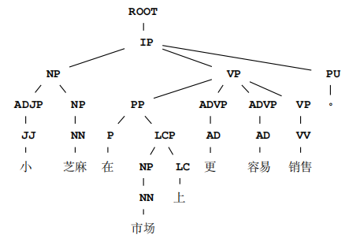

# Illustrations of the Motivation Examples

## SIT-FN
**SUT**: Google Translate

**S_s**: Steve Kennedy, the **`treasury`** secretary, forced it to alert the people who have bought a phone found to be substandard, rather than **taking down listing**.

**S_f**: Steve Kennedy, the **`interior`** secretary, forced it to alert the people who have bought a phone found to be substandard, rather than **taking down listing**.

**T_s**: *美国*财政部长史蒂夫·肯尼迪强迫该公司向那些购买了不合格手机的人发出警告，而不是*下架*。

**Meaning**: Steve Kennedy, the treasury secretary ***of the U.S.*,** forced it to alert the people who have bought a phone found to be substandard, rather than ***removed from shelves***.

**T_f**: 内政部长史蒂夫·肯尼迪强迫该公司向那些购买了不合格手机的人发出警告，而不是*删除清单*。

**Meaning**: Steve Kennedy, the treasury secretary, forced it to alert the people who have bought a phone found to be substandard, rather than ***delete list***.

**Explanation:** 
- Explanation to why this example is a violation:
  - The input words "taking down listing" are translated as different meanings in T_s and T_f, i.e., "removed from shelves" in T_s and "delete list" in T_f.
  - T_s have a redundant word "美国", which means "the U.S." and does not exist in T_f.
- Explanation to why this example is identified as non-violation by SIT:
  - The dependency parse tree of T_s:
  - 
  - The dependency parse tree of T_f:
  - 
  - Distance between the tags of the two dependency parse trees is 2, which is below the threshold (6), thus SIT regards this example as non-violation.

## CAT-FP
**SUT**: Google Translate

**S_s**: The app will be released next `Sunday` **when everything is ready**.

**S_f**: The app will be released next `year` **when everything is ready**.

**T_s**: 该应用程序将于下周日*一切准备就绪后*发布。

**Meaning**: The app will be released next Sunday ***when everything is ready***.

**T_f**: *当一切准备就绪后*，该应用程序将于明年发布。

**Meaning**: ***When everything is ready***, the app will be released next Sunday.

**Explanation:**
- Explanation to why this example is not a violation:
  - Although the adverbial clause of "当一切准备就绪后" (when everything is ready) is at different postition in T_s and T_f, it does not change meaning.
- Explanation to why this example is identified as a violation by CAT:
  - Similarity score (calculated by CAT) between T_s and T_f , which is 37.8%, is below the threshold (80.0%), thus CAT regards this example as violation.

## Purity-FP
**SUT**: Google Translate

**S_s**: English **tests** and **Chinese tests** for the **children** `will be canceled on Tuesday.`

**S_f**: English **tests** and **Chinese tests** for the **children**

**T_s**: 周二*孩子们*的英语*考试*和*中文考试*将被取消。

**Meaning**: English ***tests*** and ***Chinese tests*** for the ***children*** will be canceled on Tuesday.

**T_f**: *儿童*英语*测试*和*汉语测试*

**Meaning**: English ***tests*** and ***Chinese tests*** for the ***children***

**Explanation:**
- Explanation to why this example is not a violation:
  - "孩子们" in T_s and "儿童" in T_f share the same meaning, which are "children".
  - "考试" in T_s and "测试" in T_f share the same meaning, which are "tests".
  - "中文考试" in T_s and "汉语测试" in T_f share the same meaning, which are "Chinese tests".
- Explanation to why this example is identified as a violation by Purity:
  - Distance between T_s and T_f , which is 4, is above the threshold (1), thus Purity regards this example as violation.

## CIT-FN
**SUT**: Bing Microsoft Translator

**S_s**: The small **assorted** sesame is easier to sell in the market. 

**S_f**: `Therefore,` the small **assorted** sesame is easier to sell in the market.

**T_s**: 小芝麻在市场上更容易销售。

**Meaning**: The small sesame is easier to sell in the market. 

**T_f**: 因此，小*什锦*芝麻更容易在市场上销售。

**Meaning**: Therefore, the small ***assorted*** sesame is easier to sell in the market.

**Explanation:** 
- Explanation to why this example is a violation:
  - The input word "assorted" is not translated in T_s but is translated in T_f as "什锦" (assorted).
- Explanation to why this example is identified as non-violation by CIT:
  - The constituency parse tree of T_s:
  - 
  - The constituency parse tree of T_f:
  - 
  - Every path in the constituency parse tree of T_s exists in that of T_f , thus CIT regards this example as non-violation.

## PatInv-FN
**SUT**: Bing Microsoft Translator

**S_s**: In January, most **policies** would offer the maintenance costs of the building during the `pandemic`. 

**S_f**: In January, most **policies** would offer the maintenance costs of the building during the `holiday`.

**T_s**: 在 1 月份，大多数*保单*都会提供大流行期间建筑物的维护成本。

**Meaning**: In January, most ***guarantee slip*** would offer the maintenance costs of the building during the pandemic. 

**T_f**: 在一月份，大多数*政策*都会在假期期间提供建筑物的维护费用。

**Meaning**: In January, most ***policies*** would offer the maintenance costs of the building during the holiday.

**Explanation:** 
- Explanation to why this example is a violation:
  - The input word "policies" is translated as different meanings, i.e., "保单" (guarantee slip) in T_s and "政策" (policies) in T_f.
- Explanation to why this example is identified as a violation by PatInv:
  - T_s and T_f are different, thus PatInv regards this example as non-violation.